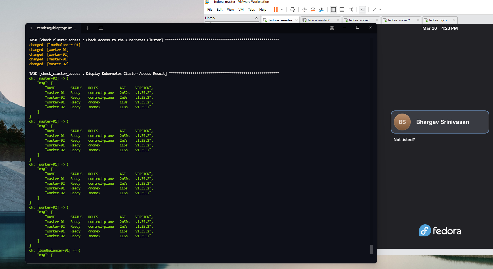

## Kubernetes cluster, on an Atomic/Immutable OS (Fedora Silverblue)

- Multi Master, has two master nodes (2..N) for high availability/failover
- Nginx loadbalancer fronting the two master nodes, can be extended to N
- Multi Play playbook, for before and after a restart to facilitate package installs
- Kubeadm init phase on master nodes and join phases
- Cluster bootstraps two worker nodes (2..N)
- Using Cilium CNI instead of Flannel

(2..N) -> Installed on two nodes, can be generalized to N
  
Work in progress, experimenting with Cilium and OTEL

Aim is to improve telemetry, observability, security and governance and learn these well

